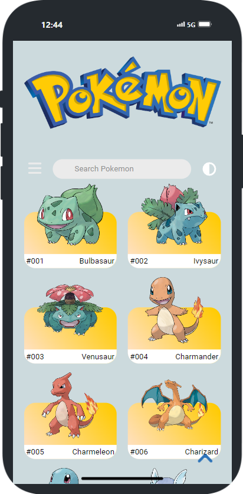
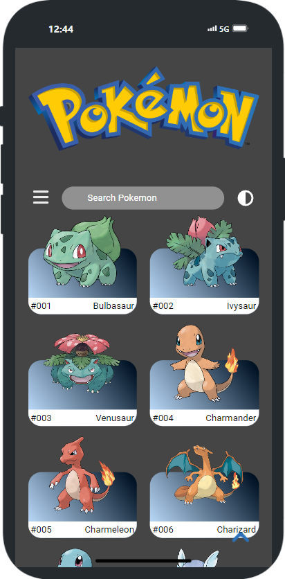
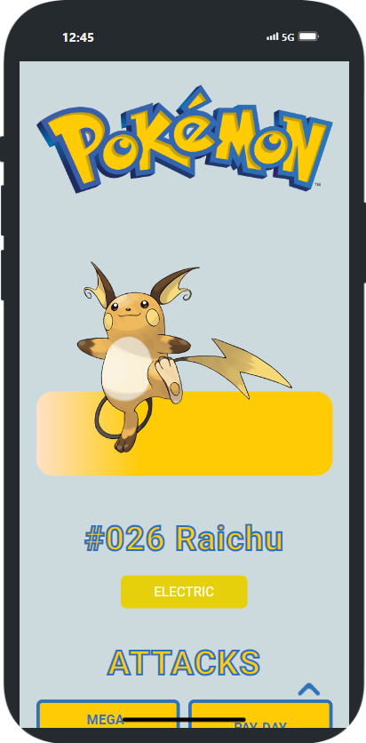
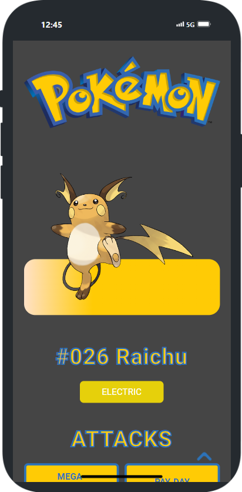
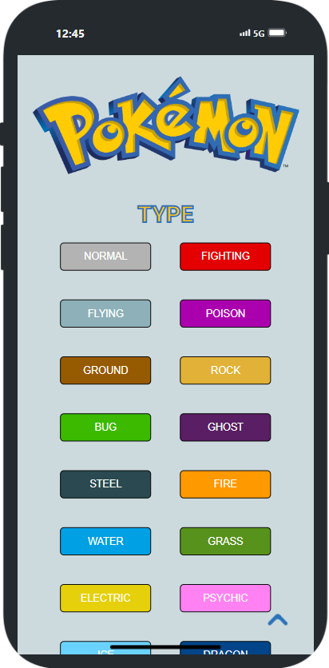
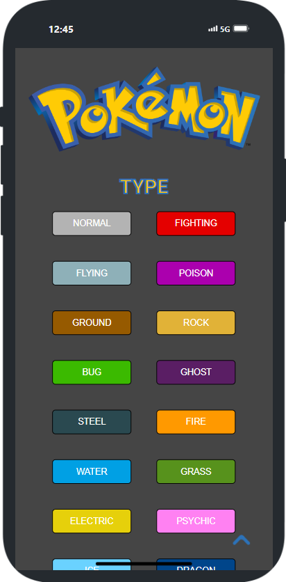

<h1 align="center"><samp>Pokemon App</samp> </h1>

 
  
  
  

<h3><samp>Contributors:</samp></h3>
<ul>
<a href="https://github.com/xoFrey"><li><samp>Izel Acar</samp></li></a>
<a href="https://github.com/MiaMarmeladenbrot"><li><samp>Mia Mecklenburg</samp></li></a>
<a href="https://github.com/Hkndevit"><li><samp>Hakan Devit</samp></li></a>

</ul>

<h3><samp>Build with:</samp></h3>
<ul>
<li><samp>ReactJS Vite</samp></li>
<li><samp>JavaScript</samp></li>
<li><samp>HTML5</samp></li>
<li><samp>CSS</samp></li>
</ul>

<h3><samp>Features:</samp></h3>
<ul>
<li><samp>Made with <a href="https://pokeapi.co/">Poke API</a></samp></li>
<li><samp>Dynamic Detail Page for each Pokemon</samp></li>
</ul>

<h2><samp>Live site</samp></h2>
<li><samp><a href="https://poke-dex-livid-two.vercel.app">Live Page</a></samp></li>

<h2><samp>Screenshot</samp></h2>

  

  

  

